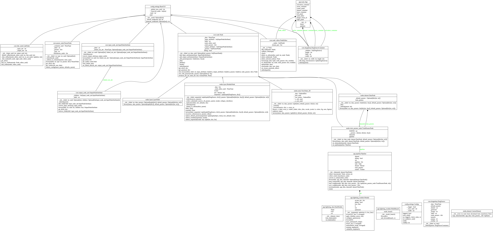
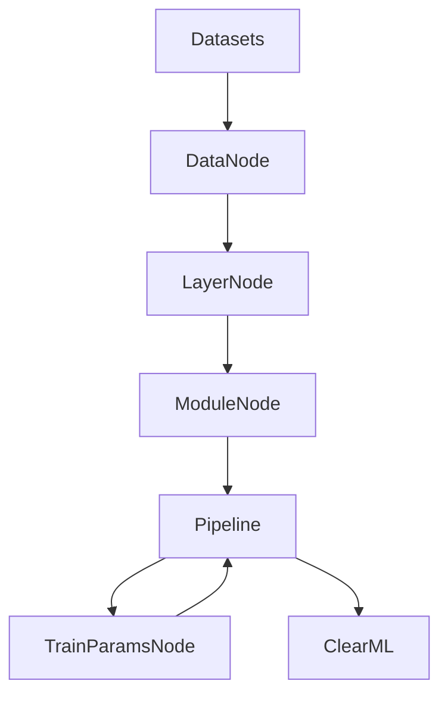

# Deep Learning Constructor (DLC)


## О проекте

**Deep Learning Constructor (DLC)** — это визуальный конструктор нейросетей нового поколения, ориентированный на исследователей, студентов и инженеров, которым необходима гибкая, наглядная и расширяемая среда для проектирования, обучения и анализа глубоких моделей. DLC позволяет собирать архитектуры любой сложности из готовых блоков, визуализировать пайплайны, настраивать параметры и запускать обучение без необходимости писать код вручную.

---

## Основные возможности

- 🧩 **Визуальное проектирование**: drag-and-drop интерфейс для построения нейросетей из модулей, слоёв, функций активации и датасетов.
- 🏗️ **Гибкая архитектура**: поддержка кастомных и стандартных архитектур (LeNet, AlexNet, VGG, GoogLeNet, NiN и др.), возможность создавать собственные пайплайны.
- 🧬 **Расширяемость**: легко добавлять новые датасеты, слои, функции активации и архитектуры.
- ⚡ **Интерактивное обучение**: запуск, остановка, дообучение, сохранение и загрузка весов моделей прямо из GUI.
- 📊 **Интеграция с ClearML**: автоматический логгинг экспериментов, параметров и результатов.
- 🖼️ **Визуализация архитектуры**: встроенные UML-диаграммы классов и блок-схемы (см. папку `design/`).
- 📝 **Логирование и сообщения**: подробный вывод статуса, ошибок и прогресса обучения.

---

## Архитектура

- **GUI**: Построен на DearPyGui с кастомными темами, drag-and-drop контейнерами и интерактивными окнами.
- **Node Editor**: Графовый редактор для визуального соединения модулей, слоёв и датасетов.
- **DataNode, LayerNode, ModuleNode**: Классы для представления данных, слоёв и модулей соответственно.
- **Pipeline**: Класс для автоматической сборки, обучения и управления пайплайном.
- **TrainParamsNode**: Узел для настройки гиперпараметров обучения (оптимизатор, функция потерь, инициализация, lr, эпохи и др.).
- **Интеграция с PyTorch Lightning**: для удобного и масштабируемого обучения моделей.

<details>
<summary>UML-диаграмма классов (кликните для увеличения)</summary>



</details>

---

## Быстрый старт

### 1. Установка зависимостей

```bash
pip install -r requirements.txt
```

### 2. Запуск приложения

```bash
python app/main.py
```

### 3. Использование

- Перетаскивайте датасеты, слои, функции активации и архитектуры из левой и правой панелей в центральное рабочее поле.
- Соединяйте блоки для построения пайплайна.
- Настраивайте параметры каждого блока через всплывающие окна.
- Запускайте обучение, сохраняйте и загружайте веса, отслеживайте прогресс через интеграцию с ClearML.

---

## Интерфейс

<details>
<summary>Скриншот интерфейса (кликните для увеличения)</summary>


</details>

### Основные элементы интерфейса:

- **Левая панель**: Содержит доступные датасеты и готовые архитектуры нейросетей
- **Правая панель**: Включает слои, функции активации и модули для построения сети
- **Центральная область**: Рабочее пространство для визуального конструирования нейросети
- **Нижняя панель**: Лог сообщений и статуса выполнения операций
- **Всплывающие окна**: Для настройки параметров узлов и конфигурации обучения

### Управление:

- **Drag & Drop**: Перетаскивание компонентов из боковых панелей
- **Соединения**: Создание связей между узлами через точки входа/выхода
- **Контекстное меню**: Дополнительные опции при правом клике на узлы
- **Горячие клавиши**: Быстрый доступ к основным функциям

---

## Поддерживаемые компоненты

- **Датасеты**: FashionMNIST, Caltech101/256, CIFAR10, Flowers102, SUN397, CarlaStereo, CelebA, Cityscapes, CLEVRClassification, CocoCaptions, EuroSAT, Food101, ImageNet, а также пользовательские датасеты.
- **Слои**: LazyLinear, LazyConv1d/2d/3d, BatchNorm, Flatten, Concatenate, Pooling, Dropout и др.
- **Функции активации**: ReLU, Sigmoid, Tanh.
- **Архитектуры**: LeNet-5, AlexNet, VGG-11, NiN, GoogLeNet, Conv-MLP, Inception, BN LeNet и др.

---

## Требования

- Python 3.11+
- PyTorch 2.0+
- torchvision
- pytorch-lightning
- dearpygui
- clearml
- (см. requirements.txt)

---

## Схема работы



---

## Визуализация и документация

- Все диаграммы классов и архитектур находятся в папке [`design/`](design/).
- Для подробного ознакомления с архитектурой откройте UML-диаграмму [`classes.png`](design/classes.png) и см. изображения [`dlc-1.png` ... `dlc-4.png`](design/).

---

## Лицензия

Проект распространяется под лицензией MIT.

---

## Контакты и поддержка

- Вопросы и предложения: создавайте issue или pull request.
- Для связи: telegramm - @luzinsan

---

<p align="center">
  <b>Создавайте, обучайте и исследуйте нейросети быстрее с Deep Learning Constructor!</b>
</p>
